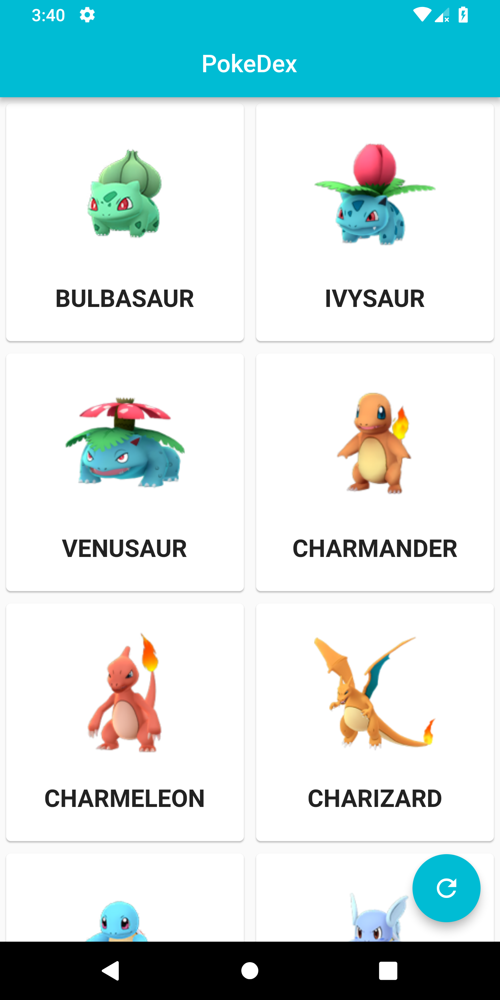

# POKEDEX

Pokedex created using flutter
Followed this tutorial :
https://www.youtube.com/watch?v=yeXJqZCiwTQ

### SCREENSHOTS

|                   |                   |                   |                   |
| :---------------: | :---------------: | :---------------: | :---------------: |
|  |  |  |  |
